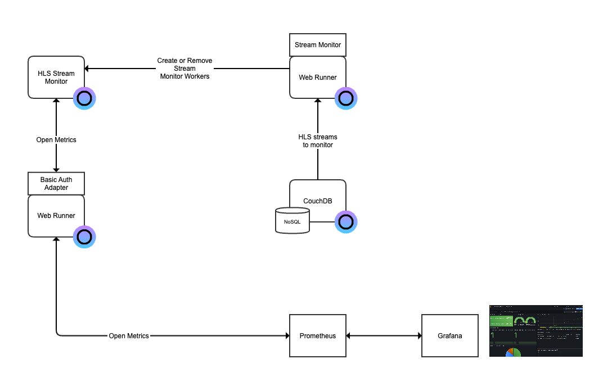
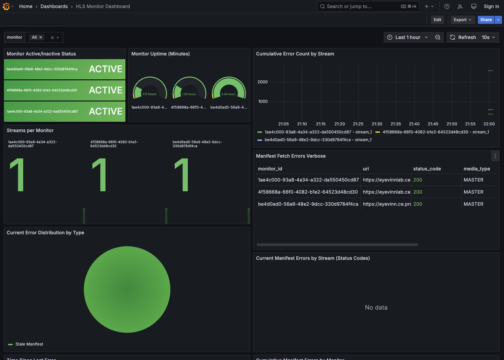

# HLS Stream Monitor platform

This is an example of a HLS Stream Monitor platform built with open web services in Eyevinn Open Source Cloud.

Requires 3 available services in your plan. If you have no available services in your plan you can purchase each service individually or upgrade your plan.

## Architecture Overview



This solution consists of an HLS Stream Monitor that monitors one or many HLS live streams for errors. It provides an OpenMetrics endpoint that Prometheus can scrape and be visualized in Grafana. To manage what streams to monitor we have a database and a service to create or remove streams from the stream monitor.

### HLS Stream Monitor

The open web service that is responsible for monitoring the live streams is the HLS Stream Monitor. It provides an API to manage running monitors and a monitor can check one or many HLS streams. It also provides an OpenMetrics endpoint that can be scraped by metrics collectors such as Prometheus.

To enable access to the monitor instance outside of Eyevinn Open Source Cloud we launch a Basic Auth adapter running in a Web Runner. This provides a Basic Auth authentication to access the instance and metrics endpoint.

### Stream Monitor Manager

To manage what streams to monitor and controlling the HLS Stream Monitor we have an application running in a Web Runner that reads the list of streams to monitor from a CouchDB NoSQL database.

## Building the Stream Monitor Manager

Before we start building the Stream Monitor Manager that we will be running in a Web Runner we will first create a CouchDB database for the Stream Monitor Manager.

Clone this repository:

```bash
% git clone git@github.com:EyevinnOSC/solutions.git
```

Create a folder and copy the files from the folder [monitor-manager](monitor-manager/).

```bash
% mkdir mymonitormanager
% cp -r solutions/hls-stream-monitor-platform/monitor-manager/* mymonitormanager/
```

Enter the folder you created and install dependencies.

```bash
% cd mymonitormanager
% npm install
```

Store your personal-access-token in the environment variable called `OSC_ACCESS_TOKEN`.

```bash
% export OSC_ACCESS_TOKEN=<personal-access-token>
```

This example implementation will connect to a CouchDB instance called `hlsmon` and a database called `streams`. If your CouchDB instance and/or database is named differently you need to update the functions `getDbUrl()` and `getHlsStreams()` in `mymonitormanager/src/index.ts`. It will also create an HLS Stream Monitor instance called `test` if it does not already exists.

Then you can test running the manager on your local computer.

```bash
% npm start
> monitor-manager@1.0.0 start
> ts-node src/index.ts

Server listening at http://127.0.0.1:8080
```

It will check the database for new entries and if the stream is not being monitored it will add the stream to the monitor. This implementation does not handle if you remove a stream from the database and is left as an exercise for the reader.

## Deploy manager

We will now deploy the manager using the [open web service Web Runner](https://app.osaas.io/dashboard/service/eyevinn-web-runner). The Web Runner
fetches the code from a private (or public) GitHub repository so we will first create
a repository for the orchestrator we built.

```bash
% git init
```

Add a file called `.gitignore` that contains the following.

```
dist/
node_modules/
```

Create a GitHub repository in your GitHub account and push the code. 

```bash
% git remote add origin git@github.com:<your-git-org>/<git-repo>.git
% git branch -M main
% git push -u origin main
```

Then create a Web Runner instance in the Eyevinn Open Source Cloud web console or the OSC command line tool.

```bash
% osc create eyevinn-web-runner mymanager \
  -o GitHubUrl=https://github.com/<your-git-org>/<git-repo> \
  -o GitHubToken="{{secrets.ghtoken}}" \
  -o OscAccessToken="{{secrets.osctoken}}"
```


## Setting up Prometheus and Grafana

As an example we will setup a local Grafana and Prometheus for visualizing the monitoring. This setup includes pre-configured dashboards and data sources.

Before we do that we need to deploy a Basic Auth adapter in a Web Runner. Create a new Web Runner in the web console or with the OSC command line tool.

```bash
% osc create eyevinn-web-runner myadapter \
  -o GitHubUrl=https://github.com/EyevinnOSC/basic-auth-adapter \
  -o GitHubToken="{{secrets.ghtoken}}" \
  -o OscAccessToken="{{secrets.osctoken}}"
```

Now you have an adapter that provides Basic Auth authentication to your HLS Stream Monitor metrics instance. Now it is time to setup Prometheus and Grafana.

Go to the folder with Grafana setup.

```bash
% cd grafana
```

Update the target in `prometheus.yml` config file with the hostname of your Basic Auth adapter.

```yaml
global:
  scrape_interval: 15s

scrape_configs:
  - job_name: 'hls-monitor'
    metrics_path: '/test/metrics'
    basic_auth:
      username: 'myuser'
      password: 'changeme'
    static_configs:
      - targets: ['eyevinnlab-myadapter.eyevinn-web-runner.auto.prod.osaas.io']

```

Start the Prometheus and Grafana containers.

```bash
% docker-compose up -d
```

### Verify Prometheus setup

1. Open Prometheus in your browser: http://localhost:9090
2. Navigate to Status -> Targets
3. Verify that the hls-monitor target is showing as "UP"
   - If it's not UP, check that you can reach the metrics endpoint `https://eyevinnlab-myadapter.eyevinn-web-runner.auto.prod.osaas.io/test/metrics` where `test` is the name of the HLS Stream Monitor instance.
   - Verify the prometheus.yml configuration matches your setup

### Configure Grafana

1. Open Grafana in your browser: http://localhost:3001
   - Default login is not required (anonymous access is enabled)
2. Add Prometheus Data Source:
   - Go to Configuration (⚙️) -> Data Sources
   - Click "Add data source"
   - Select "Prometheus"
   - Set URL to: `http://prometheus:9090`
   - Click "Save & Test"
   - You should see "Data source is working"

### Import the dashboard

1. In Grafana, go to Dashboards (four squares icon)
2. Click "Import"
3. Either:
   - Copy the contents of demo-dashboard.json and paste into the "Import via panel json" field
   - Or click "Upload JSON file" and select the demo-dashboard.json file
4. Click "Load"
5. Select your Prometheus data source in the dropdown
6. Click "Import"

### Verify the Dashboard

Your dashboard should now be loaded and showing metrics from your HLS monitor. You should see:

- Monitor status indicators
- Error counts and distributions
- Stream health metrics
- Various other monitoring panels

