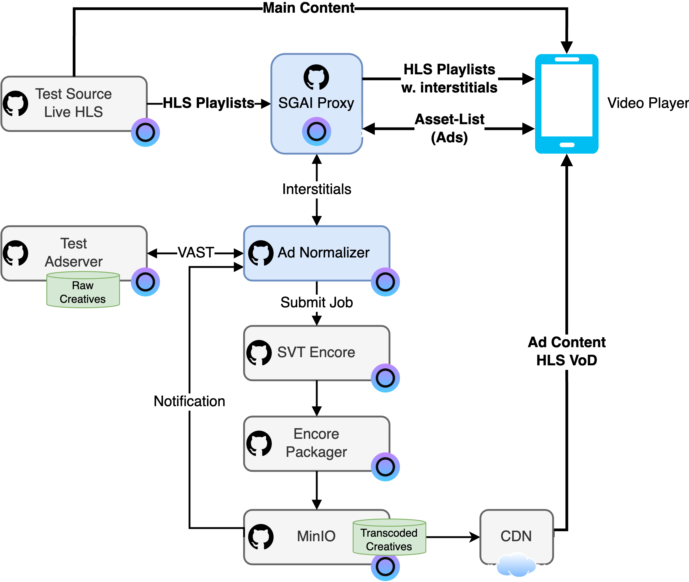

# Server-Guided Ad Insertion as a Service

This is an example of inserting ad breaks into existing HLS stream with open web services in Eyevinn Open Source Cloud.

Requires 7 available services in your plan. If you have no available services in your plan you can purchase each service individually or upgrade your plan.

## Architecture Overview



Related components include testing HLS source, test ad server, ad normalizer and SGAI proxy.

### Prepare HLS Live stream

It is possible to use an existing HLS live stream for testing, or you can use the [Test Source Live HLS](https://app.osaas.io/dashboard/service/eyevinn-docker-testsrc-hls-live) service in the Eyevinn Open Source Cloud. While creating the service, you can choose a name for this stream, for example, `sgai`. The service will start a live stream looping over a video in the following URL:

```m3u8
https://demo-sgai.eyevinn-docker-testsrc-hls-live.auto.prod.osaas.io/loop/master.m3u8
```

It can be interesting to watch the stream in a player like QuickTime Player or HLS.js.

### Prepare Test Ad Server

Similarly, you can use an existing ad server for testing, or you can use the [Test Ad Server](https://app.osaas.io/dashboard/service/eyevinn-test-adserver) service in the Eyevinn Open Source Cloud. While creating the service, you can choose a name for this ad server, for example, `sgai`. The service will start an ad server that serves a VAST XML files on demand in the following endpoint:

```url
https://demo-sgai.eyevinn-test-adserver.auto.prod.osaas.io/api/v1/vast
```

A call to this endpoint will return a VAST XML file with raw creatives (MP4). Such creatives in the ad-server response are in most cases not from a video file perspective aligned with the main content and this can cause some challenges to provide a smooth transition for the viewer. To align these media files with the main content, one can use the [Ad Normalizer](https://app.osaas.io/dashboard/service/eyevinn-ad-normalizer) service.

### Prepare Ad Normalizer

Ad Normalizer acts as a proxy for the ad-server and parses the VAST XML response from the ad-server. It will check all media files in the response and removes all ads in the XML that does not have a normalized media file before it is returned to the client. The media files for the removed ads are normalized using an SVT Encore based transcoder and packaging pipeline.

To start the Ad Normalizer service, you need to have a media processing pipeline consisting of the following:

* A running instance of SVT Encore
* A service that handles encore callbacks
* A packaging service to handle the transcoded files
* A minio bucket for the packaged assets

Such a pipeline can easily be created using [Eyevinn open source cloud](https://docs.osaas.io/osaas.wiki/Solution%3A-VOD-Transcoding.html). Once the pipeline is created, you can create an instance of the Ad Normalizer service named `sgai` with following variables:

| Variable                | Description                                                           | Default value | Mandatory |
| ----------------------- | --------------------------------------------------------------------- | ------------- | --------- |
| `ENCORE_URL`            | The URL of your encore instance                                       | none          | yes       |
| `CALLBACK_LISTENER_URL` | The URL of your encore callback listener                              | none          | yes       |
| `AD_SERVER_URL`         | The url of your ad server                                             | none          | yes       |
| `OUTPUT_BUCKET_URL`     | The url to the output folder for the packaged assets                  | none          | yes       |
| `S3_ACCESS_KEY`         | Your S3 access key                                                    | none          | yes       |
| `S3_SECRET_KEY`         | Your S3 secret key                                                    | none          | yes       |
| `S3_ENDPOINT`           | The S3 instance endpoint endpoint                                     | none          | yes       |
| `LOG_LEVEL`             | The log level of the service                                          | Info          | no        |
| `REDIS_URL`             | The url of your redis instance                                        | none          | no       |
| `PORT`                  | The port that the server listens on                                   | 8000          | no        |
| `OSC_ACCESS_TOKEN`      | your OSC access token. Only needed when running encore in Eyevinn OSC | none          | no        |

Once the service is started, you can use the following endpoint to get a JSON conforming to the asset list standard used for HLS interstitials:

```bash
curl -v -H 'accept: application/json' "https://demo-sgai.eyevinn-ad-normalizer.auto.prod.osaas.io/api/v1/vast?dur=30"
```

If the instance is brand new, and your redis instance is unpopulated, you should get an empty list. Otherwise you should get a list of assets that are available for insertion.

```json
{
  "ASSETS": [
    {
      "DURATION": "30",
      "URI": "https://your-minio-endpoint/creativeId/substring/index.m3u8"
    }
  ]
}
```

### Prepare SGAI Proxy

The SGAI Proxy is a service that acts as a proxy between the original HLS live stream and the video player. It will handle the insertion of the ads into the live stream playlist and fetch the transcoded creatives from the Ad Normalizer.

To create a [SGAI service](https://app.osaas.io/dashboard/service/eyevinn-sgai-ad-proxy), use the vast endpoint from Ad Normalizer and the original HLS live stream URL. In our example, we use the following URLs:

```url
# Ad Normalizer
https://demo-sgai.eyevinn-ad-normalizer.auto.prod.osaas.io/api/v1/vast?dur=30
# Original stream
https://demo-sgai.eyevinn-docker-testsrc-hls-live.auto.prod.osaas.io/loop/master.m3u8
```

Once the service is started, you can use the following endpoint to get the modified playlist.

```url
https://demo-sgai.eyevinn-sgai-ad-proxy.auto.prod.osaas.io/loop/master.m3u8
```

### Play the stream

Congratulations! Now a new stream with ad breaks inserted is available.

You can play the stream in a player like QuickTime Player or HLS.js. The player should play the original stream with ad breaks inserted.
