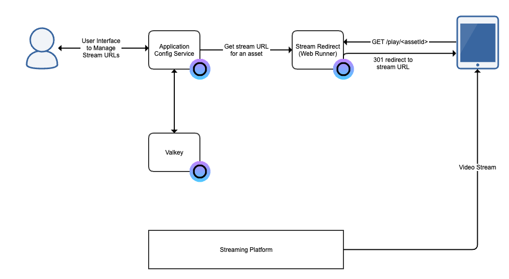

# Stream Playback Endpoint

This is an example of a stream playback endpoint that the client video players request video stream URLs for a channel or an asset. The stream URL for a channel or asset is configurable in a web user interface.

Requires 3 available services in your plan. If you have no available services in your plan you can purchase each service individually or upgrade your plan.

## Architecture Overview



This solution consists of a stream URL configurator and a service that redirects the client video player to the stream URL that is configured. It is built with the open web services:

 - [Application Config Service](https://app.osaas.io/dashboard/service/eyevinn-app-config-svc)
 - [Valkey store](https://app.osaas.io/dashboard/service/valkey-io-valkey)
 - Redirect Service running as a [Web Runner](https://app.osaas.io/dashboard/service/eyevinn-web-runner)

## Building the Redirect Service

The Redirect Service is a NodeJS service that is deployed as a Web Runner. The Web Runner
fetches the code from a private (or public) GitHub repository so we will first [create a fork](https://docs.github.com/en/pull-requests/collaborating-with-pull-requests/working-with-forks/fork-a-repo) of a [sample Stream Redirect service](https://github.com/EyevinnOSC/stream-redirect) on our GitHub.

Clone the fork to your local disk.

```bash
% git clone git@github.com:<your-github-org>/stream-redirect.git
```

By default it will create an instance of the Application Config Service and Valkey server called `streamredirector` if it does not already exists. Modify the code in `src/index.ts` if you want to use another name and credentials.

Then create a Web Runner instance in the Eyevinn Open Source Cloud web console. Take a note of the URL to the web runner instance.

Navigate to the Application Config Service and click on the instance card called `streamredirector` (or the modified name you provided). Add a key called `myasset` and the URL to a stream.

Provide the video player with the url `https://<web-runner-url>/play/myasset` and it will be redirected to the stream URL configured for `myasset`.

Now you can change the stream URL without having to update the links to the video players every time.