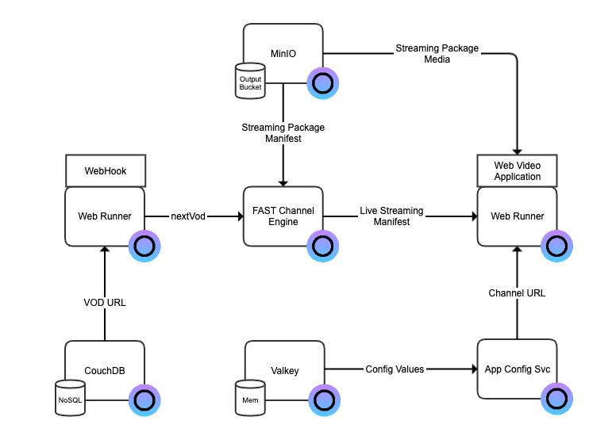
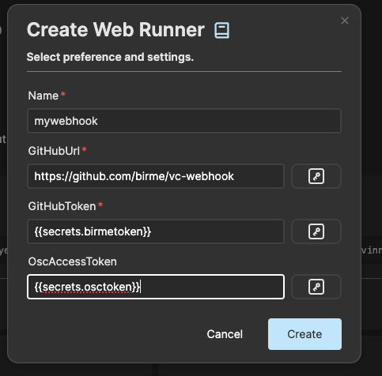
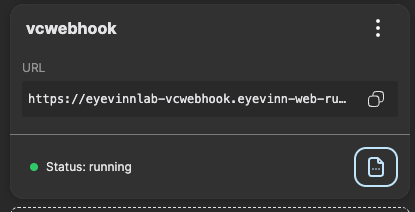
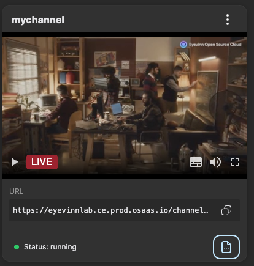

# Virtual Channels Platform

This is an example of a platform for virtual linear TV channels. A virtual channel is
generated from a library of Video-On-Demand (VOD) files without having to do any
live transcoding. This is the most cost-efficient solution to generate linear TV channels at scale.

The creation of VOD files is not in the scope of this example as that part is covered in the [vod streaming platform](../vod-streaming-platform/) example.

Requires 5 available services in your plan. If you have no available services in your plan you can purchase each service individually or upgrade your plan.

## Architecture Overview



This solution consists of a virtual channel playout and a simple web application fetching configuration from an application configuration service.

### Virtual Channel Playout

The virtual channel playout is built with the open web services:

- FAST Channel Engine generating and providing the player with the live streaming manifest.
- Web Runner to provide the webhook that the engine calls to decide what to play next in the channel.
- CouchDB for storing the database of assets and URLs to the VOD streaming packages.

### Web Video Application

The web video application is a NextJS based web application that reads the channel
configuration from an application configuration service and provides the player to view the
channel.

## Building the WebHook

Clone this repository:

```bash
% git clone git@github.com:EyevinnOSC/solutions.git
```

Create a folder and copy the files from the folder [webhook](webhook/).

```bash
% mkdir mywebhook
% cp -r solutions/virtual-channels-platform/webhook/* mywebhook/
```

Enter the folder you created and install dependencies.

```bash
% cd mywebhook
% npm install
```

Store your personal-access-token in the environment variable called `OSC_ACCESS_TOKEN`.

```bash
% export OSC_ACCESS_TOKEN=<personal-access-token>
```

This example implementation will connect to a CouchDB instance called `vodsvc` and a database called `myassets`. If your CouchDB instance and/or database is named differently you need to update the functions `getDbUrl()` and `getAssets()` in `webhook/src/index.ts`.

Then you can test running the webhook on your local computer.

```bash
% npm start
> vc-webhook@1.0.0 start
> ts-node src/index.ts

Server listening at http://127.0.0.1:8080
```

Test the webhook with `curl` or another HTTP client.

```bash
% curl -v "http://localhost:8080/nextVod?channelId=hej"
{"id":"83aa1b6e-5fa5-4026-905d-8a2c4d8fde17","title":"Random VOD","hlsUrl":"https://eyevinnlab-vodsvc.minio-minio.auto.prod.osaas.io/vodsvc/osc-reel4/83aa1b6e-5fa5-4026-905d-8a2c4d8fde17/index.m3u8"}
```

## Deploy webhook

We will now deploy this webhook using the [open web service Web Runner](https://app.osaas.io/dashboard/service/eyevinn-web-runner). The Web Runner
fetches the code from a private (or public) GitHub repository so we will first create
a repository for the orchestrator we built.

```bash
% git init
```

Add a file called `.gitignore` that contains the following.

```
dist/
node_modules/
```

Create a GitHub repository in your GitHub account and push the code. 

```bash
% git remote add origin git@github.com:<your-git-org>/<git-repo>.git
% git branch -M main
% git push -u origin main
```

Then create a Web Runner instance in the Eyevinn Open Source Cloud web console.



Now you have a webhook available online that your channel engine instance will use to request what to play out next. Take a note of the URL to the webhook, e.g. https://eyevinnlab-vcwebhook.eyevinn-web-runner.auto.prod.osaas.io/nextVod. Find the URL on the instance card of the web runner instance in the web console.



## Creating a virtual channel

To create a virtual channel we will use the Eyevinn Open Source Cloud command line tool.

```bash
% npx @osaas/cli create channel-engine mychannel \
  -o type=WebHook \
  -o url=https://eyevinnlab-vcwebhook.eyevinn-web-runner.auto.prod.osaas.io/nextVod \
  -o opts.useDemuxedAudio=true 
```

Ths option `opts.useDemuxedAudio` instructs the engine that the VODs have separate files for audio and video which we have in this case.

Navigate to the FAST Channel Engine service in Eyevinn Open Source Cloud and you should see the channel you just created.



## Building the Web Video Application

