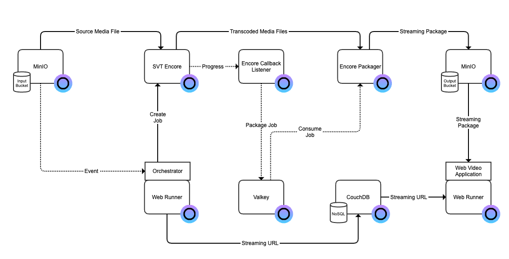

# VOD Streaming Platform

This is an example of a VOD streaming platform built with open web services in Eyevinn Open Source Cloud.

Requires 7 available services in your plan. If you have no available services in your plan you can purchase each service individually or upgrade your plan.

## Architecture Overview



This solution consists of a VOD preparation pipeline, orchestrator, database and a simple web application.

### VOD Preparation Pipeline

The VOD preparation pipeline is built with the open web services:

 - SVT Encore for transcoding the source video file to a bundle of video files with different resolutions and qualities, often referred to as ABR transcoding.
 - Encore Packager to create a streaming package that is adapted for video delivery over HTTP
 - MinIO providing the storage buckets that is needed

### Orchestrator

The orchestrator consumes events from the input bucket and creates a VOD preparation job when a new file is added. It is a NodeJS server application that we will develop and deploy in a Web Runner instance. The orchestrator will register in a database all files that have been processed.

### Web Video Application

The web video application is a NextJS based web application that will fetch the available files from the database and enable playback using a web video player.

## Building the Orchestrator

Clone this repository:

```bash
% git clone git@github.com:EyevinnOSC/solutions.git
```

Create a folder and copy the files from the folder [orchestrator](orchestrator/).

```bash
% mkdir myorchestrator
% cp -r solutions/vod-streaming-platform/orchestrator/* myorchestrator/
```

Enter the folder you created and install dependencies.

```bash
% cd myorchestrator
% npm install
```

Store your personal-access-token in the environment variable called `OSC_ACCESS_TOKEN`.

```bash
% export OSC_ACCESS_TOKEN=<personal-access-token>
```

Then you can test running the orchestrator on your local computer.

```bash
% npm start
```

It will create and setup a VOD processing pipeline with the input and output buckets required.
A listener for the input bucket is also created.

You can test that this part works by uploading an MP4 file to the input bucket that was created.
For example using the Minio client tool

```bash
% mc cp osc-reel.mp4 vodsvcinput/vodsvcinput/osc-reel.mp4
```

