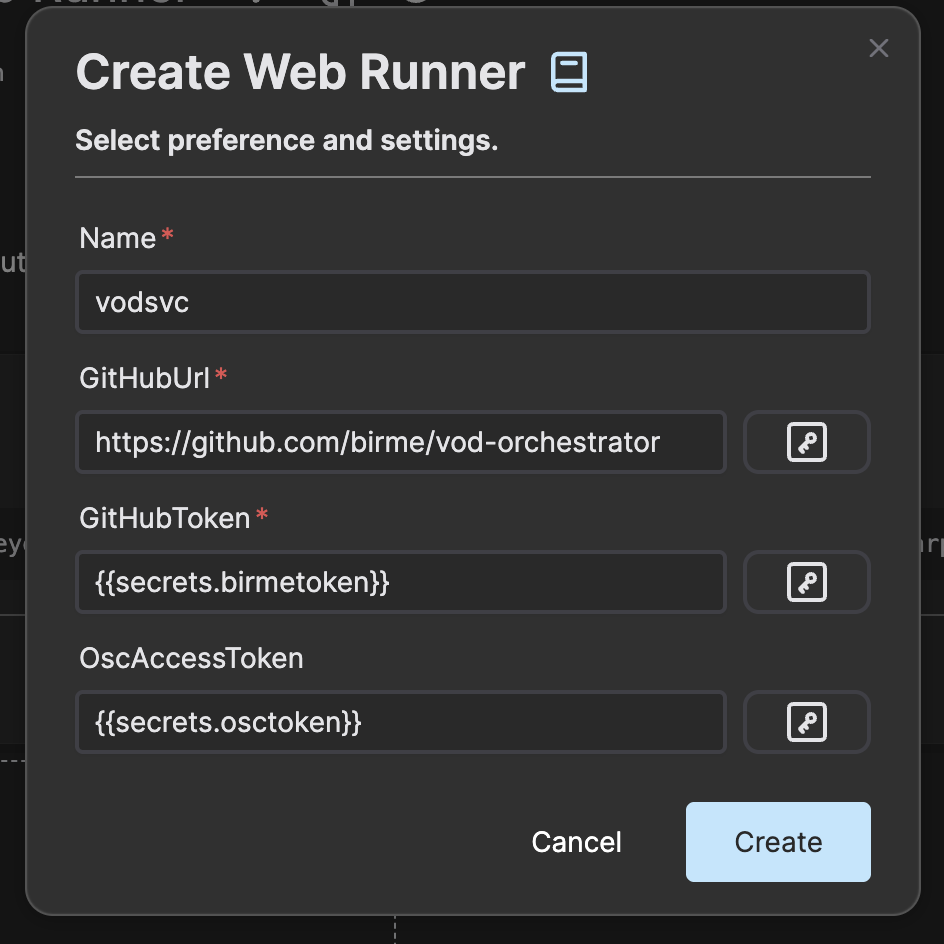
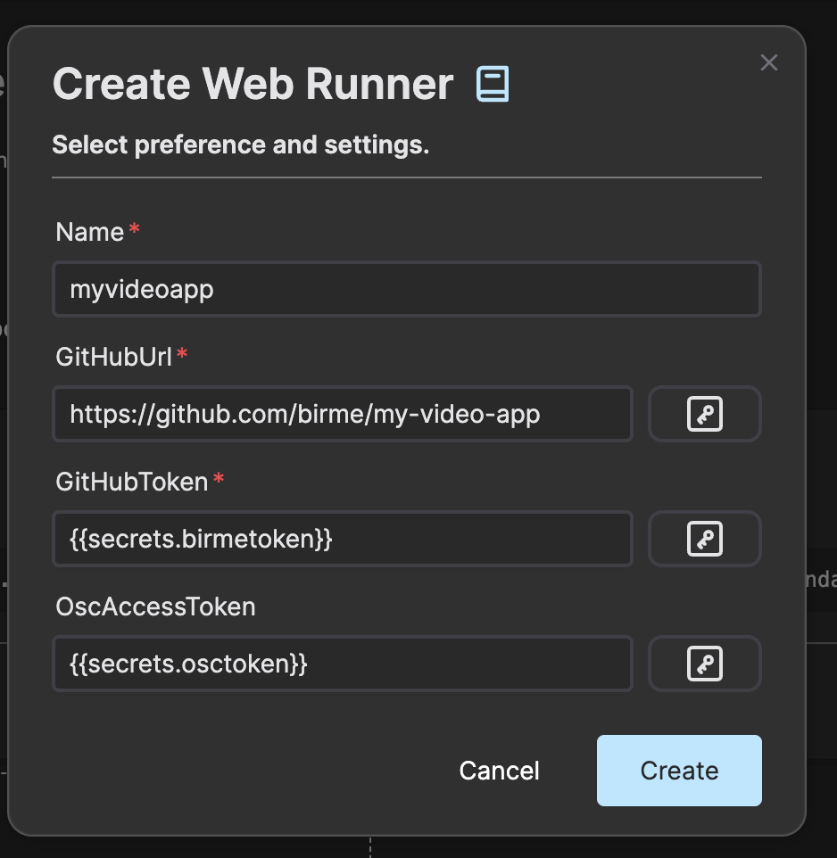
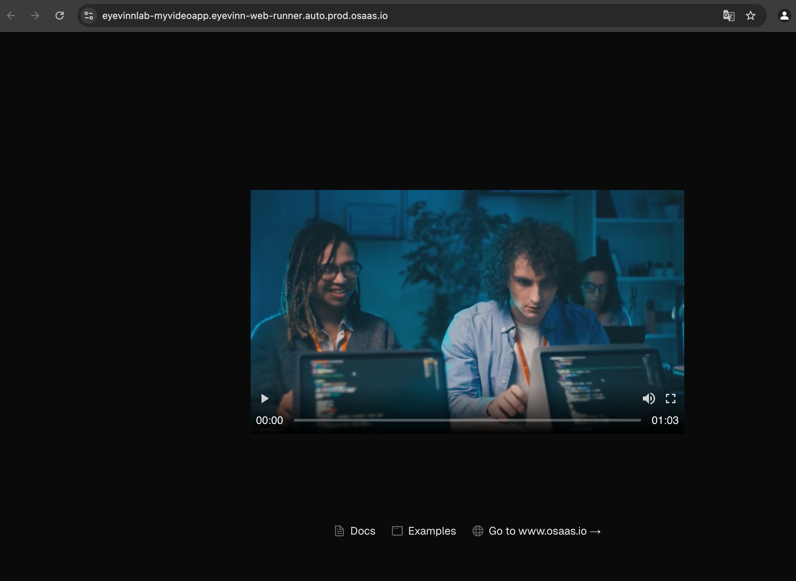

# VOD Streaming Platform

This is an example of a VOD streaming platform built with open web services in Eyevinn Open Source Cloud.

Requires 7 available services in your plan. If you have no available services in your plan you can purchase each service individually or upgrade your plan.

## Architecture Overview


This solution consists of a VOD preparation pipeline, orchestrator, database and a simple web application.

### VOD Preparation Pipeline

The VOD preparation pipeline is built with the open web services:

 - SVT Encore for transcoding the source video file to a bundle of video files with different resolutions and qualities, often referred to as ABR transcoding.
 - Encore Packager to create a streaming package that is adapted for video delivery over HTTP
 - MinIO providing the storage buckets that is needed

### Orchestrator

The orchestrator consumes events from the input bucket and creates a VOD preparation job when a new file is added. It is a NodeJS server application that we will develop and deploy in a Web Runner instance. The orchestrator will register in a database all files that have been processed.

### Web Video Application

The web video application is a NextJS based web application that will fetch the available files from the database and enable playback using a web video player.

## Building the Orchestrator

Clone this repository:

```bash
% git clone git@github.com:EyevinnOSC/solutions.git
```

Create a folder and copy the files from the folder [orchestrator](orchestrator/).

```bash
% mkdir myorchestrator
% cp -r solutions/vod-streaming-platform/orchestrator/* myorchestrator/
```

Enter the folder you created and install dependencies.

```bash
% cd myorchestrator
% npm install
```

Store your personal-access-token in the environment variable called `OSC_ACCESS_TOKEN`.

```bash
% export OSC_ACCESS_TOKEN=<personal-access-token>
```

Then you can test running the orchestrator on your local computer.

```bash
% npm start
```

It will create and setup a VOD processing pipeline with the input and output buckets required.
A listener for the input bucket is also created and a NoSQL database (CouchDB)

You can test that this part works by uploading an MP4 file to the input bucket that was created.
For example using the Minio client tool

```bash
% mc cp osc-reel.mp4 vodsvcinput/vodsvcinput/osc-reel.mp4
```

An asset with the URL to the streaming package is created and saved to the database.

## Deploy orchestrator

We will now deploy this orchestrator using the [open web service Web Runner](https://app.osaas.io/dashboard/service/eyevinn-web-runner). The Web Runner
fetches the code from a private (or public) GitHub repository so we will first create
a repository for the orchestrator we built.

```bash
% git init
```

Add a file called `.gitignore` that contains the following.

```
dist/
node_modules/
```

Create a GitHub repository in your GitHub account and push the code. 

```bash
% git remote add origin git@github.com:<your-git-org>/<git-repo>.git
% git branch -M main
% git push -u origin main
```

Then create a Web Runner instance in the Eyevinn Open Source Cloud web console.



Now everything is orchestrated in the cloud and when you upload a file to the input bucket it will automatically transcode and create a VOD package for streaming.

## Building the Web Video Application

Now it is time to build the web video application that will fetch the list of assets from the database and using a web player to stream the assets.

Create a new folder for the application and copy the files from the folder [application](application/).

```bash
% mkdir myvideoapp
% cp -r solutions/vod-streaming-platform/application/* myvideoapp/
```

Enter the folder you created and install dependencies.

```bash
% cd myvideoapp
% npm install
```

Build the application

```bash
% npm run build
```

Given that your personal access token is stored in the environment variable `OSC_ACCESS_TOKEN`
you can start the application with this command.

```bash
% npm start
```

Deploy this application the same way as you deployed the orchestrator using the Web Runner.



Now when the Web Runner is up and running you can click on the instance card and go to
the web application that is now available online.

